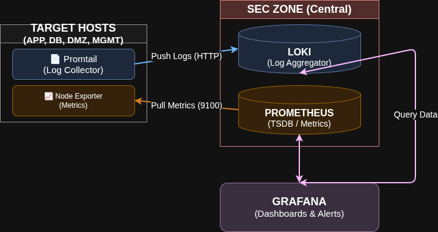

# Zero-Trust Virtual Data Center

## About
This project provides a production-ready Virtual Data Center (VDC) built on Zero-Trust principles. It focuses on automated deployment, network security, and centralized identity management. The infrastructure uses tools and technologies such as **pfSense, Suricata, Squid, FreeIPA, Ansible, Nginx, MariaDB, Docker Rootless, Prometheus, Loki, Grafana, Promtail, Node Exporter, Rocky Linux, and Alpine Linux.**

## Technical Stack
- **Virtualization:** KVM/QEMU, Libvirt, Virt-Manager.
- **Operating Systems:** Rocky Linux 10.1, Alpine Linux.
- **Network & Security:** pfSense, VLAN Segmentation, Suricata, Squid Proxy, Openvpn VPN.
- **Identity & IAM:** FreeIPA (LDAP, Kerberos, DNS, NTP, CA, RBAC/HBAC).
- **Web & Proxy:** Nginx (Reverse Proxy), Squid (Proxy).
- **Containerization:** Docker (Rootless Mode).
- **Databases:** MariaDB.
- **Automation & IaC:** Ansible (Agentless Configuration Management, Playbook Development), Shell Scripting.
- **Observability:** Prometheus (Metrics), Loki (Log Aggregation), Grafana (Visualization), Node Exporter, Promtail.

---

## Network Architecture

The architecture is segmented into eight discrete VLANs to minimize the attack surface and enforce strict traffic control. Every internal and external communication path is inspected by the pfSense firewall.


### Network Segmentation (VLANs)
- **MGMT (VLAN 10):** Management Plane. Hosts the Jump Server and Ansible Controller for centralized administrative control.
- **CORPLAN (VLAN 20):** Corporate LAN segment for internal trusted services.
- **DMZ (VLAN 30):** Perimeter network isolating public-facing services (Nginx).
- **APP (VLAN 40):** Application Logic layer utilizing Rootless Docker containers for privilege escalation mitigation.
- **DB (VLAN 50):** Database Tier hosting MariaDB with LUKS-level disk encryption.
- **SEC (VLAN 60):** Security Operations Center (SOC) stack for centralized monitoring.
- **GUEST (VLAN 70):** Isolated guest segment with strictly regulated internet-only access.
- **BACKUP (VLAN 80):** Storage layer for automated backups and Golden Image preservation.

## Security Framework (Zero-Trust Flow)

The core security model assumes no trust between network segments. Traffic is denied by default and only explicitly permitted through granular firewall policies based on the principle of least privilege.

### Identity & Access Governance
Centralized identity management is managed by FreeIPA. The system utilizes HBAC and RBAC to restrict administrative access to authorized personnel via a secure Jump Server.

## Observability and Monitoring

- **Metric Collection:** Prometheus scrapes system-level metrics via Node Exporter.
- **Log Management:** Promtail ships logs from all nodes to a centralized Loki instance.
- **Data Visualization:** Grafana provides dashboards for real-time analysis.



## Automation and Infrastructure as Code (IaC)

The entire environment is managed via Ansible. This ensures configuration consistency across all VLANs, eliminates manual errors, and provides a scalable framework for automated deployments.

## Repository Structure

```bash
.
├── Configs/                # pfSense config.xml. Network configs
├── Diagrams/               # Source and exported architecture files
├── Documentation/          # Technical reports and asset inventory
├── Infrastructure/         # Technical configuration files and scripts
│   ├── Ansible/            # Production playbooks, roles, and inventory
│   ├── IPA_DNS/            # Identity management and DNS zone files
│   ├── MariaDB/            # Database hardening and schema configurations
│   ├── Nginx/              # Reverse proxy and TLS configurations
│   ├── Squid/              # Web filtering and proxy rules
│   └── Observability/      # Monitoring and Logging stack configurations
│       ├── Grafana/        # Dashboard JSONs and data source YAMLs
│       ├── Prometheus/     # Scrape configurations and alert rules
│       ├── Loki/           # Log retention and storage settings
│       └── Promtail/       # Log collection and labeling pipelines
├── Screenshots/            # System implementation and dashboard evidence
└── README.md
```

   